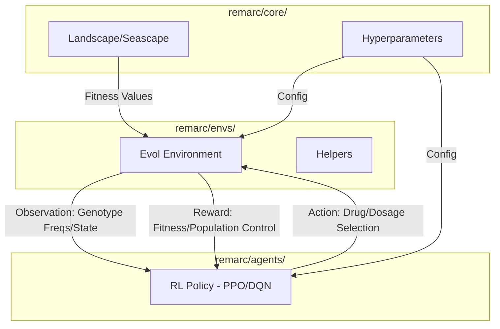

# Architecture Overview

This document describes the high-level architecture of `remarc`, a reinforcement learning framework for optimizing dosing strategies in cancer populations.

## System Components

The project is refactored into modular sub-packages within `remarc/` for better maintainability:

### 1. Evolutionary Environments (`remarc/envs/`)
Provides [Gymnasium](https://gymnasium.farama.org/)-compatible environments that simulate the evolution of a population.
- **`SSWMEnv`** ([sswm_env.py](file:///Users/chaaranathb/Developer/GitRepo/remarc-orig/evo_dm/remarc/envs/sswm_env.py)): Simulates Strong Selection Weak Mutation dynamics.
- **`WrightFisherEnv`** ([wright_fisher_env.py](file:///Users/chaaranathb/Developer/GitRepo/remarc-orig/evo_dm/remarc/envs/wright_fisher_env.py)): Simulates genetic drift and population-level frequencies.
- **`evol_env` / `evol_env_wf`** ([legacy_env.py](file:///Users/chaaranathb/Developer/GitRepo/remarc-orig/evo_dm/remarc/envs/legacy_env.py)): Legacy environments maintained for backward compatibility.
- **`helpers.py`**: Shared utility functions for environment setup and simulation runs.

### 2. Core Logic (`remarc/core/`)
Defines the fundamental building blocks of the simulations.
- **`Landscape` / `Seascape`** ([landscapes.py](file:///Users/chaaranathb/Developer/GitRepo/remarc-orig/evo_dm/remarc/core/landscapes.py)): Modeling fitness and concentration-dependent evolution.
- **`Hyperparameters`** ([hyperparameters.py](file:///Users/chaaranathb/Developer/GitRepo/remarc-orig/evo_dm/remarc/core/hyperparameters.py)): Global configuration and parameter presets.

### 3. Reinforcement Learning Agents (`remarc/agents/`)
- **Tianshou Integration** ([tianshou_agent.py](file:///Users/chaaranathb/Developer/GitRepo/remarc-orig/evo_dm/remarc/agents/tianshou_agent.py)): Modern RL algorithms like PPO and DQN.
- **Legacy Learners** ([legacy_learner.py](file:///Users/chaaranathb/Developer/GitRepo/remarc-orig/evo_dm/remarc/agents/legacy_learner.py)): Individual implementations for specific experimental setups.

### 4. Utilities (`remarc/utils/`)
- **`data.py`** / **`est_growth_rates.py`**: Data loading, seascape preprocessing, and growth rate estimation from plate reader data.
- **`misc.py`**: General purpose helpers and plotting functions.

## Data Flow

